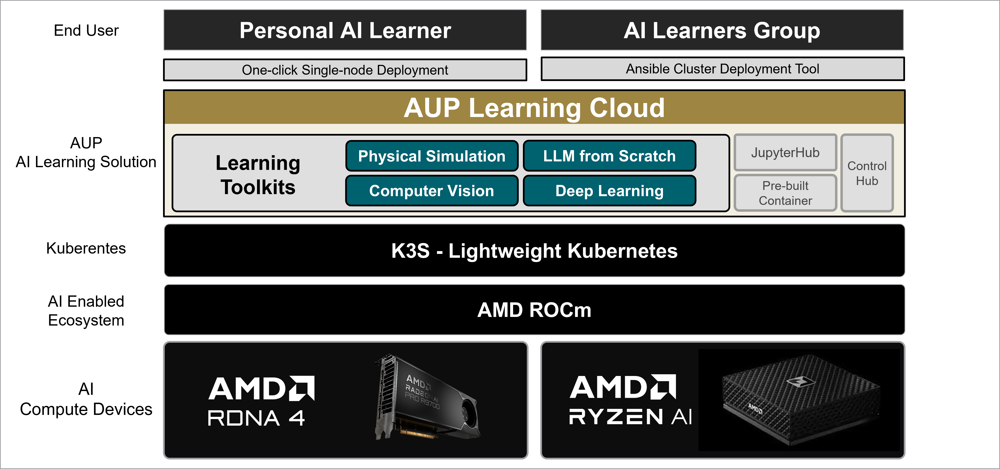

<!-- Copyright (C) 2025 Advanced Micro Devices, Inc. All rights reserved.  Portions of this notebook consist of AI-generated content. -->
<!--
Permission is hereby granted, free of charge, to any person obtaining a copy
of this software and associated documentation files (the "Software"), to deal
in the Software without restriction, including without limitation the rights
to use, copy, modify, merge, publish, distribute, sublicense, and/or sell
copies of the Software, and to permit persons to whom the Software is
furnished to do so, subject to the following conditions:

The above copyright notice and this permission notice shall be included in all
copies or substantial portions of the Software.

THE SOFTWARE IS PROVIDED "AS IS", WITHOUT WARRANTY OF ANY KIND, EXPRESS OR
IMPLIED, INCLUDING BUT NOT LIMITED TO THE WARRANTIES OF MERCHANTABILITY,
FITNESS FOR A PARTICULAR PURPOSE AND NONINFRINGEMENT. IN NO EVENT SHALL THE
AUTHORS OR COPYRIGHT HOLDERS BE LIABLE FOR ANY CLAIM, DAMAGES OR OTHER
LIABILITY, WHETHER IN AN ACTION OF CONTRACT, TORT OR OTHERWISE, ARISING FROM,
OUT OF OR IN CONNECTION WITH THE SOFTWARE OR THE USE OR OTHER DEALINGS IN THE
SOFTWARE.
-->

# AUP Learning Cloud

AUP Learning Cloud is a tailored JupyterHub deployment designed to provide an intuitive and hands-on AI learning experience. It features a comprehensive suite of AI toolkits running on AMD hardware acceleration, enabling users to learn and experiment with ease.



## Learning Solution

AUP Learning Cloud offers the following Learning Toolkits:

> [!IMPORTANT]
> Only [**Deep Learning**](projects/DL) and [**Large Language Model from Scratch**](projects/LLM) are available in the v1.0 release.

- [**Computer Vision**](projects/CV) \
Includes 10 hands-on labs covering common computer vision concepts and techniques.

- [**Deep Learning**](projects/DL) \
Includes 12 hands-on labs covering common deep learning concepts and techniques.

- [**Large Language Model from Scratch**](projects/LLM) \
Includes 9 hands-on labs designed to teach LLM development from scratch.

## Quick Start

The simplest way to deploy AUP Learning Cloud on a single machine in a development or demo environment.

### Prerequisites
- **Hardware**: AMD Ryzen™ AI Halo Device (e.g., AI Max+ 395, AI Max 390)
- **Memory**: 32GB+ RAM (64GB recommended)
- **Storage**: 500GB+ SSD
- **OS**: Ubuntu 24.04.3 LTS
- **Docker**: Install Docker and configure for non-root access

```bash
# Install Docker
curl -fsSL https://get.docker.com | sh

# Add current user to docker group
sudo usermod -aG docker $USER

# Apply group changes without logout (or logout/login instead)
newgrp docker
```

> **Note**: See [Docker Post-installation Steps](https://docs.docker.com/engine/install/linux-postinstall/) and [Install Docker Engine on Ubuntu](https://docs.docker.com/engine/install/ubuntu/) for details.

### Installation
```bash
git clone https://github.com/AMDResearch/aup-learning-cloud.git
cd aup-learning-cloud/deploy/
sudo ./single-node.sh install
```

After installation completes, open http://localhost:30890 in your browser. No login credentials are required - you will be automatically logged in.

### Script Commands

| Command | Description |
|---------|-------------|
| `install` | Full installation (K3s, tools, GPU plugin, images, JupyterHub) |
| `uninstall` | Complete removal of all components |
| `upgrade-runtime` | Upgrade JupyterHub deployment |
| `build-images` | Build and import container images |
| `install-tools` | Install Helm and K9s only |
| `install-runtime` | Deploy JupyterHub only |
| `remove-runtime` | Remove JupyterHub only |

Example:
```bash
# Upgrade JupyterHub after configuration changes
sudo ./single-node.sh upgrade-runtime

# Rebuild images after modifying Dockerfiles
sudo ./single-node.sh build-images
```

## Manual Installation

For users who prefer step-by-step manual installation or need more control over the deployment process:

- [Single-Node Manual Deployment](deploy/README.md#single-node-deployment) - Detailed manual setup for development and demo environments
- [Multi-Node Cluster Deployment](deploy/README.md#multi-node-cluster-deployment) - Production deployment with Ansible playbooks

## Key Features

### Hardware Acceleration

AUP Learning Cloud provides a multi-user Jupyter notebook environment with the following hardware acceleration:

- **AMD GPU**: Leverage ROCm for high-performance deep learning and AI workloads.
- **AMD NPU**: Utilize Ryzen™ AI for efficient neural processing unit tasks.
- **AMD CPU**: Support for general-purpose CPU-based computations.

### Flexible Deployment

Kubernetes provides a robust infrastructure for deploying and managing JupyterHub. We support both single-node and multi-node K3s cluster deployments.

### Authentication

Seamless integration with GitHub Single Sign-On (SSO) and Native Authenticator for secure and efficient user authentication.
- **Auto-admin on install**: Initial admin created automatically with random password
- **Dual login**: GitHub OAuth + Native accounts on single login page
- **Batch user management**: CSV/Excel-based bulk operations via scripts

### Storage Management and Security

Dynamic NFS provisioning ensures scalable and persistent storage for user data, while end-to-end TLS encryption with automated certificate management guarantees secure and reliable communication.

## Available Notebook Environments

Current environments are set up as `RESOURCE_IMAGES` in `runtime/jupyterhub/files/hub`. These settings should be consistent with `Prepullers` in `runtime/values.yaml`.

| Environment | Image                                    | Version | Hardware                        |
| ----------- | ---------------------------------------- | ------- | ------------------------------- |
| Base CPU    | `ghcr.io/amdresearch/auplc-default` | v1.0    | CPU                             |
| CV COURSE   | `ghcr.io/amdresearch/auplc-cv`    | v1.0  | GPU (Strix-Halo) |
| DL COURSE   | `ghcr.io/amdresearch/auplc-dl`    | v1.0  | GPU (Strix-Halo) |
| LLM COURSE  | `ghcr.io/amdresearch/auplc-llm`   | v1.0  | GPU (Strix-Halo)                |

## Documentation

- [JupyterHub Configuration](docs/jupyterhub/README.md) - Detailed JupyterHub settings
- [GitHub OAuth Setup](docs/jupyterhub/How_to_Setup_GitHub_OAuth.md) - OAuth configuration
- [Maintenance Manual](docs/user-manual/aup-remote-lab-user-manual-admin-new.md) - Operations guide

## Contributing

Please refer to [CONTRIBUTING.md](docs/contribute.md) for details on how to contribute to the project.
