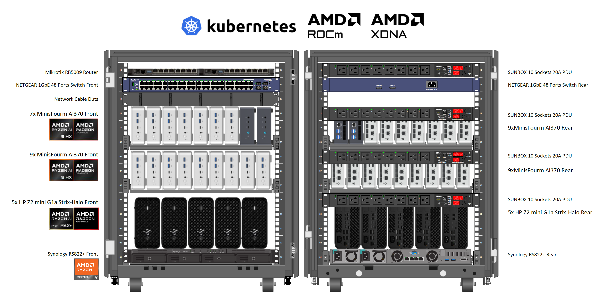

<!-- Copyright (C) 2025 Advanced Micro Devices, Inc. All rights reserved.  Portions of this notebook consist of AI-generated content. -->
<!--
Permission is hereby granted, free of charge, to any person obtaining a copy
of this software and associated documentation files (the "Software"), to deal
in the Software without restriction, including without limitation the rights
to use, copy, modify, merge, publish, distribute, sublicense, and/or sell
copies of the Software, and to permit persons to whom the Software is
furnished to do so, subject to the following conditions:

The above copyright notice and this permission notice shall be included in all
copies or substantial portions of the Software.

THE SOFTWARE IS PROVIDED "AS IS", WITHOUT WARRANTY OF ANY KIND, EXPRESS OR
IMPLIED, INCLUDING BUT NOT LIMITED TO THE WARRANTIES OF MERCHANTABILITY,
FITNESS FOR A PARTICULAR PURPOSE AND NONINFRINGEMENT. IN NO EVENT SHALL THE
AUTHORS OR COPYRIGHT HOLDERS BE LIABLE FOR ANY CLAIM, DAMAGES OR OTHER
LIABILITY, WHETHER IN AN ACTION OF CONTRACT, TORT OR OTHERWISE, ARISING FROM,
OUT OF OR IN CONNECTION WITH THE SOFTWARE OR THE USE OR OTHER DEALINGS IN THE
SOFTWARE.
-->


# Deployment Guide

This guide covers the complete deployment of AUP Learning Cloud, including Kubernetes infrastructure and JupyterHub application.

## Prerequisites

Before starting the deployment, clone this repository:

```bash
git clone https://github.com/AMDResearch/aup-learning-cloud.git
cd aup-learning-cloud
```

## Deployment Modes

| Mode | Use Case | Tools | Storage |
|------|----------|-------|---------|
| [Single Node](#single-node-deployment) | Development, demo, small-scale teaching (< 10 users) | Shell + Helm | local-path |
| [Multi-Node Cluster](#multi-node-cluster-deployment) | Production, large-scale deployment | Ansible + Helm | NFS |

---

## Single Node Deployment

A simplified deployment for development, demos, or small-scale teaching environments.

> **💡 Tip**: If you need to use alternative container registries or package mirrors, see [Mirror Configuration](#mirror-configuration).

### Prerequisites

**Hardware**
- AMD Strix / Strix-Halo AIPC or dGPU system
- 32GB+ RAM (64GB recommended)
- 500GB+ SSD

**Software**
- Ubuntu 24.04.2 LTS
- Helm 3.2.0+

### Step 1: Install K3s

```bash
# Install K3s with readable kubeconfig permissions
curl -sfL https://get.k3s.io | INSTALL_K3S_VERSION=v1.32.3+k3s1 K3S_KUBECONFIG_MODE="644" sh -

# Configure kubectl
mkdir -p ~/.kube
sudo cp /etc/rancher/k3s/k3s.yaml ~/.kube/config
sudo chown $(id -u):$(id -g) ~/.kube/config
```

> **💡 Tip**: The `K3S_KUBECONFIG_MODE="644"` environment variable sets the kubeconfig file permissions to be readable by all users. This prevents common "permission denied" errors when running kubectl commands. See [K3s Cluster Access](https://docs.k3s.io/cluster-access) for more details.

K3s includes a built-in `local-path` StorageClass. No additional storage setup required.

Verify installation:
```bash
kubectl get nodes
kubectl get storageclass
```

**Official documentation**: https://docs.k3s.io/installation

### Step 2: Install Helm

Helm is required to deploy JupyterHub. Install it after K3s is running:

```bash
# Download Helm v3.17.2 or later
wget https://get.helm.sh/helm-v3.17.2-linux-amd64.tar.gz -O /tmp/helm-linux-amd64.tar.gz

# Extract and install
cd /tmp && tar -zxvf helm-linux-amd64.tar.gz
sudo mv /tmp/linux-amd64/helm /usr/local/bin/helm
rm /tmp/helm-linux-amd64.tar.gz

# Verify installation
helm version
```

**Official documentation**: https://helm.sh/docs/intro/install/

### Step 3: Install ROCm Driver

Follow the official AMD ROCm installation guide for Ubuntu 24.04:
https://rocm.docs.amd.com/projects/install-on-linux/en/latest/install/quick-start.html

Verify installation:
```bash
rocminfo
rocm-smi
```

### Step 4: Deploy ROCm Device Plugin

```bash
kubectl create -f https://raw.githubusercontent.com/ROCm/k8s-device-plugin/master/k8s-ds-amdgpu-dp.yaml
```

Verify GPU is detected:
```bash
kubectl get nodes -o jsonpath='{.items[*].status.allocatable}' | grep amd
```

**Official documentation**: https://github.com/ROCm/k8s-device-plugin

### Step 5: Label Node

Label your node based on GPU type.

First, get the actual node name:
```bash
# List all nodes to see the actual node name
kubectl get nodes

# Store the node name in a variable
NODE_NAME=$(kubectl get nodes -o jsonpath='{.items[0].metadata.name}')
echo "Node name: $NODE_NAME"
```

Then apply the appropriate label based on your GPU type:
```bash
# For Strix-Halo
kubectl label nodes $NODE_NAME node-type=strix-halo

# For Strix
kubectl label nodes $NODE_NAME node-type=strix

# For discrete GPU
kubectl label nodes $NODE_NAME node-type=dgpu
```

Verify the label was applied:
```bash
kubectl get nodes --show-labels | grep node-type
```

### Step 6: Deploy JupyterHub

```bash
cd runtime

# Deploy JupyterHub
helm install jupyterhub ./jupyterhub \
  --namespace jupyterhub \
  --create-namespace \
  -f values.yaml
```

### Step 7: Access JupyterHub

Open http://localhost:30890 in your browser.

The default configuration uses auto-login mode - you will be automatically logged in as 'student' without requiring credentials.

---

## Multi-Node Cluster Deployment

For production environments with multiple nodes. Uses Ansible for automated cluster setup.



### Prerequisites

#### Hardware

- A 15U mini rack (standard size)
- AI370 Strix Mini PC or AI395 Strix-Halo AIPC (Example: Minisforum with dual 2.5G Ethernet)
    - Node requirement: 3 nodes minimum
    - The BIOS needs to be updated to the newest
    - You can check the BIOS update via their official website: [MinisForum](https://www.minisforum.com/pages/product-info) [GMKtec](https://www.gmktec.com/pages/drivers-and-software)
- A 1GbE or 2.5GbE network switch
- A firewall router (Optional, Mikrotik RB5009 in this case)

#### Software

All components are installed using Ansible playbooks:
- Ubuntu 24.04.2 LTS (Linux Kernel: 6.14) or above
- ROCm 7.1.0 - [Installation Guide](https://rocm.docs.amd.com/projects/install-on-linux/en/latest/install/quick-start.html)
- Ansible: 2.18.3 (Only on controller node) - [Installation Guide](https://docs.ansible.com/ansible/latest/installation_guide/intro_installation.html)
- Helm: 3.2.0+ - [Installation Guide](https://helm.sh/docs/intro/install/)
- K3s v1.32.3+k3s1 - [Official Documentation](https://docs.k3s.io/)

### Project Structure

```bash
deploy/
├── ansible/    # Host configuration and K3s cluster setup
├── k8s/        # Kubernetes components (NFS provisioner, device plugins)
└── docs/       # Documentation and images
```

### Step 1: Ansible Playbooks

Configure inventory and run playbooks to set up K3s cluster.

See [ansible/README.md](./ansible/README.md) for detailed instructions.

### Step 2: Install Helm

After K3s cluster is deployed, install Helm on the controller node:

```bash
# Download Helm v3.17.2 or later
wget https://get.helm.sh/helm-v3.17.2-linux-amd64.tar.gz -O /tmp/helm-linux-amd64.tar.gz

# Extract and install
cd /tmp && tar -zxvf helm-linux-amd64.tar.gz
sudo mv /tmp/linux-amd64/helm /usr/local/bin/helm
rm /tmp/helm-linux-amd64.tar.gz

# Verify installation
helm version
```

**Official documentation**: https://helm.sh/docs/intro/install/

### Step 3: Verify GPU/NPU Drivers

Before proceeding, ensure hardware drivers are working:

**For GPUs:**
```bash
rocminfo
rocm-smi
```

**For NPUs (TODO):**
```bash
/opt/xilinx/xrt/bin/xrt-smi validate
```

### Step 4: Kubernetes Components

Set up NFS provisioner, device plugins, and node labels.

See [k8s/README.md](./k8s/README.md) for detailed instructions.

### Step 5: Deploy JupyterHub

#### Configure Multi-Node Deployment

For multi-node cluster deployments, copy and customize the multi-node configuration:

```bash
cd runtime

# Copy multi-node configuration template
cp values-multi-nodes.yaml.example values-multi-nodes.yaml
```

Edit `values-multi-nodes.yaml` to customize for your environment. Key settings include:

```yaml
# Hub Database Storage
hub:
  db:
    pvc:
      storageClassName: nfs-client

# User Environment
singleuser:
  storage:
    dynamic:
      storageClass: nfs-client

# Ingress Configuration
ingress:
  enabled: true
  ingressClassName: traefik
  hosts:
    - your-domain.com
  tls:
    - hosts:
        - your-domain.com
      secretName: jupyter-tls-cert
```

#### Configure Authentication

##### Option 1: Auto-Login (Default for Single-Node)

Set in `runtime/values.yaml`:

```yaml
custom:
  authMode: "auto-login"
```

No credentials required. Users are automatically logged in as 'student'. Suitable for single-node, personal learning environments.

##### Option 2: GitHub OAuth

Update [runtime/values.yaml](../runtime/values.yaml):

```yaml
GitHubOAuthenticator:
  oauth_callback_url: "https://<Your-Address>/hub/github/oauth_callback"
  client_id: "YOUR-CLIENT-ID"
  client_secret: "YOUR-CLIENT-SECRET"
  allowed_organizations:
    - <YOUR-ORG-NAME>
  scope:
    - read:user
    - read:org
```

Update [jupyterhub_config.py](../runtime/jupyterhub/files/hub/jupyterhub_config.py) to map teams to resources:

```python
TEAM_RESOURCE_MAPPING = {
    "cpu": ["cpu"],
    "gpu": ["Course-CV", "Course-DL", "Course-LLM"],
    "official": ["cpu", "Course-CV", "Course-DL", "Course-LLM"],
    "AUP": ["Course-CV", "Course-DL", "Course-LLM"]
}
```

##### Option 3: Multi-Login (GitHub + Native)

Set in [jupyterhub_config.py](../runtime/jupyterhub/files/hub/jupyterhub_config.py):

```python
c.JupyterHub.authenticator_class = CustomMultiAuthenticator
```

> For more details, see [JupyterHub Configuration Guide](../docs/jupyterhub/README.md)

#### Deploy

```bash
cd runtime

helm install jupyterhub ./jupyterhub \
  --namespace jupyterhub \
  --create-namespace \
  -f values-multi-nodes.yaml
```

> **Note**: Due to prepuller settings, initial deployment may take a while to pull all images. If you see timeout issues, wait for prepuller pods to complete, then run `helm upgrade`. See [issue #42](https://github.com/AMDResearch/aup-learning-cloud/issues/42) for details.

#### Access

| Service Type | URL |
|--------------|-----|
| NodePort | http://localhost:30890 |
| LoadBalancer | Check `kubectl get svc -n jupyterhub` |
| Ingress | https://your-domain.com |

---

## Maintenance

### Update Configuration

```bash
cd runtime

# Upgrade JupyterHub
helm upgrade jupyterhub ./jupyterhub \
  --namespace jupyterhub \
  -f values-multi-nodes.yaml
```

When updating images, the prepuller will take time to pull. If a node halts, SSH into it and run `sudo systemctl restart k3s-agent`.

### Uninstall JupyterHub

```bash
helm uninstall jupyterhub --namespace jupyterhub
```

### Uninstall K3s (Single-Node Only)

```bash
/usr/local/bin/k3s-uninstall.sh
```

> For more maintenance details, see [Maintenance Manual](../docs/user-manual/aup-remote-lab-user-manual-admin-new.md)

---

## Troubleshooting

### kubectl permission denied error

If you encounter errors like:
```
error: error loading config file "/etc/rancher/k3s/k3s.yaml": open /etc/rancher/k3s/k3s.yaml: permission denied
```

**For single-node deployments:**
The K3s installation command in this guide already includes `K3S_KUBECONFIG_MODE="644"` to prevent this issue. If you still encounter permission errors:

```bash
# Verify file permissions
ls -la /etc/rancher/k3s/k3s.yaml

# If needed, copy to user directory
mkdir -p ~/.kube
sudo cp /etc/rancher/k3s/k3s.yaml ~/.kube/config
sudo chown $(id -u):$(id -g) ~/.kube/config
```

**For multi-node (Ansible) deployments:**
Add the following to your `inventory.yml` before running the playbook:
```yaml
k3s_cluster:
  vars:
    extra_server_args: "--write-kubeconfig-mode=644"
```

See [K3s Cluster Access](https://docs.k3s.io/cluster-access) for official documentation.

### Helm command not found

If `helm` command is not found, verify the installation:
```bash
# Check if helm is in PATH
which helm

# If not, ensure /usr/local/bin is in PATH
echo $PATH

# Reinstall helm if needed (see Step 2 in deployment guides above)
```

---

## Advanced Configuration

### Mirror Configuration

If you need to use alternative mirrors for container registries or package managers, you can configure them via environment variables when running the deployment script.

#### Container Registry Mirror

Set `MIRROR_PREFIX` to use a registry mirror. The prefix will be prepended to all container image references:

```bash
# Example: quay.io/jupyterhub/k8s-hub:4.1.0 becomes
#          mirror.example.com/quay.io/jupyterhub/k8s-hub:4.1.0

MIRROR_PREFIX="mirror.example.com" ./single-node.sh install
```

#### Package Manager Mirrors

Set `MIRROR_PIP` and `MIRROR_NPM` to use alternative package repositories during image builds:

```bash
MIRROR_PIP="https://pypi.example.com/simple" \
MIRROR_NPM="https://registry.example.com" \
./single-node.sh build-images
```

#### Combined Example

```bash
MIRROR_PREFIX="mirror.example.com" \
MIRROR_PIP="https://pypi.example.com/simple" \
MIRROR_NPM="https://registry.example.com" \
./single-node.sh install
```

For available environment variables, run:
```bash
./single-node.sh help
```
