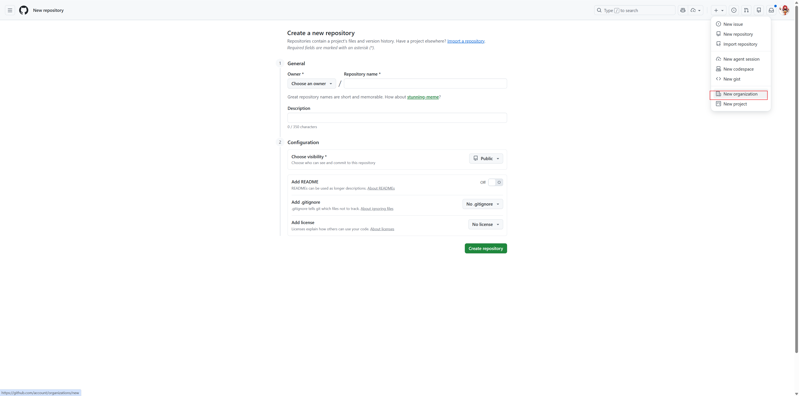
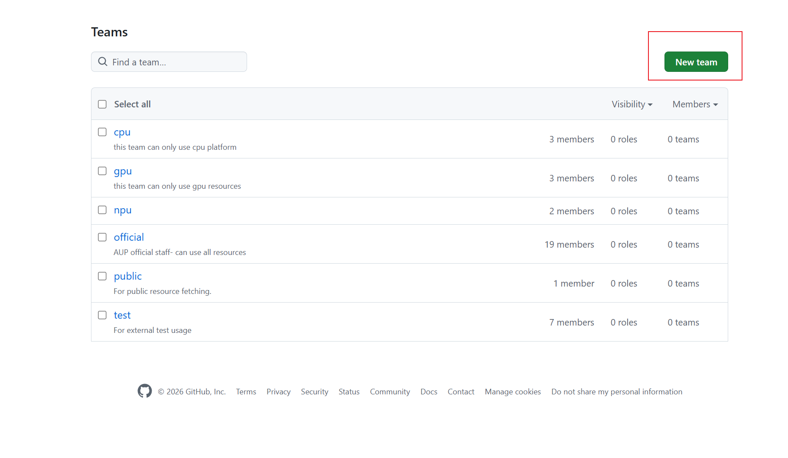
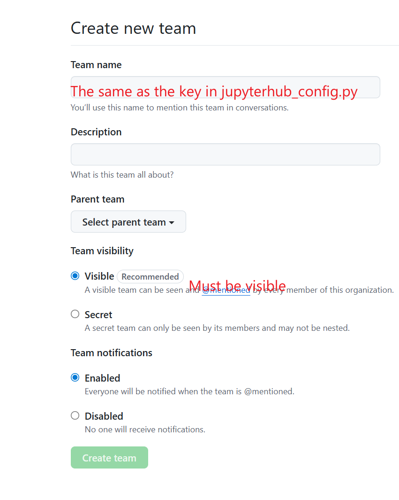
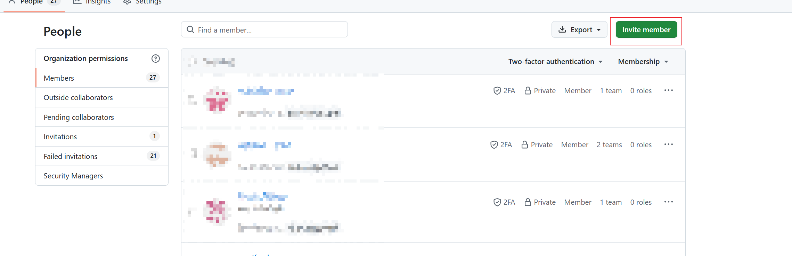

<!-- Copyright (C) 2025 Advanced Micro Devices, Inc. All rights reserved.  Portions of this notebook consist of AI-generated content. -->
<!--
Permission is hereby granted, free of charge, to any person obtaining a copy
of this software and associated documentation files (the "Software"), to deal
in the Software without restriction, including without limitation the rights
to use, copy, modify, merge, publish, distribute, sublicense, and/or sell
copies of the Software, and to permit persons to whom the Software is
furnished to do so, subject to the following conditions:

The above copyright notice and this permission notice shall be included in all
copies or substantial portions of the Software.

THE SOFTWARE IS PROVIDED "AS IS", WITHOUT WARRANTY OF ANY KIND, EXPRESS OR
IMPLIED, INCLUDING BUT NOT LIMITED TO THE WARRANTIES OF MERCHANTABILITY,
FITNESS FOR A PARTICULAR PURPOSE AND NONINFRINGEMENT. IN NO EVENT SHALL THE
AUTHORS OR COPYRIGHT HOLDERS BE LIABLE FOR ANY CLAIM, DAMAGES OR OTHER
LIABILITY, WHETHER IN AN ACTION OF CONTRACT, TORT OR OTHERWISE, ARISING FROM,
OUT OF OR IN CONNECTION WITH THE SOFTWARE OR THE USE OR OTHER DEALINGS IN THE
SOFTWARE.
-->

# How to Setup GitHub OAuth for JupyterHub

This guide will walk you through the process of setting up GitHub OAuth for your JupyterHub deployment.

## Prerequisites

1. A GitHub account
2. Administrative access to your JupyterHub deployment
3. Your JupyterHub domain/URL

## Step 1: Create a New GitHub Organization

1. Go to [github.com](https://github.com) and click on `+` icon in the top right
2. Click **New Organization** from the dropdown menu

   

3. Fill in the organization details:
   - Enter your **Organization name** (e.g., "AUP-INT-TEST")
   - Provide a **Contact email**
   - Select whether this organization belongs to "My personal account" or "A business or institution"
   - Complete the verification puzzle
   - Accept the Terms of Service
   - Click **Next** to create the organization

   

## Step 2: Create Teams to Assign Different Permissions

Teams allow you to organize members and control access to different resources in your JupyterHub deployment.

1. Navigate to your organization's **Teams** page
2. Click the **New team** button in the top right

   

3. Fill in the team creation form:
   - **Team name**: Use the same name as the key in your `jupyterhub_config.py` (e.g., "cpu", "gpu", "npu", "official")
   - **Description**: Add a description of what this team is for
   - **Team visibility**: Select **Visible** (recommended) - this allows all organization members to see the team
   - **Team notifications**: Choose whether to enable notifications
   - Click **Create team**

   

4. Repeat this process to create all the teams you need for your resource mapping (e.g., cpu, gpu, npu, official, public, test)

## Step 3: Add Members to the Organization

1. Go to the **People** tab in your organization
2. Click the **Invite member** button in the top right

   

3. In the invitation dialog:
   - Enter the member's **email address or GitHub username**
   - Click **Invite**

   

4. Assign the member to appropriate teams and roles:
   - **Role in the organization**: 
     - Select **Member** for normal users (can see all members and be granted access to repositories)
     - Select **Owner** for admin users (full administrative rights to the organization)
   - **Teams**: Select the teams this member should belong to (e.g., cpu, gpu, official)
   - Click **Send invitation**

   

5. Repeat this process for all members you want to add to your organization

## Step 4: Create a GitHub App

> **Note**: GitHub Apps are the recommended way to integrate with GitHub. They are created under the organization (not a personal account), support fine-grained permissions, and enable private repository access for users.

1. Go to your organization's GitHub App creation page:
   `https://github.com/organizations/<your-organization>/settings/apps/new`

   

2. Fill in the basic information:
   - **GitHub App name**: A unique name (e.g., "auplc-hub")
   - **Homepage URL**: Your JupyterHub URL (e.g., `https://your.domain.com`)
   - **Callback URL**: Your OAuth callback URL
     - Single auth: `https://<your-domain>/hub/oauth_callback`
     - Multi auth: `https://<your-domain>/hub/github/oauth_callback`

   

   - **Expire user authorization tokens**: Check (recommended)
   - **Request user authorization (OAuth) during installation**: Check
   - **Webhook → Active**: Uncheck (not needed)

   

3. Set permissions:
   - **Repository permissions**:
     - `Contents`: Read-only (for cloning private repos)
     - `Metadata`: Read-only (selected by default)

   

   - **Organization permissions**:
     - `Members`: Read-only (for team-based access control)

   

4. Installation scope:
   - **Where can this GitHub App be installed?**: Any account
   - Click **Create GitHub App**

   

5. After creation, note down the following:
   - **Client ID**: Displayed on the App's General page (e.g., `Iv23liXXXXXX`)
   - **Client secret**: Click **Generate a new client secret** — copy it immediately
   - **App slug**: The URL-safe name in the App's URL (e.g., `auplc-hub`)

   

## Step 5: Configure JupyterHub

1. Open your deployment configuration file (`runtime/values.yaml` or environment-specific override)

2. Add the GitHub App configuration:

   ```yaml
   custom:
     gitClone:
       githubAppName: "your-app-slug"  # Enables private repo access & repo picker

   hub:
     config:
       GitHubOAuthenticator:
         oauth_callback_url: "https://<Your.domain>/hub/github/oauth_callback"
         client_id: "<GitHub App Client ID>"
         client_secret: "<GitHub App Client Secret>"
         allowed_organizations:
           - <YOUR-ORG-NAME>
         scope: []  # GitHub App uses App-level permissions, not OAuth scopes
   ```

   > **Note**: `scope: []` is correct for GitHub Apps. Permissions (Contents, Members, etc.) are configured in the App settings on GitHub, not via OAuth scopes.

3. Configure team-to-resource mapping in `values.yaml`:

   ```yaml
   custom:
     teams:
       mapping:
         cpu:
           - cpu
         gpu:
           - Course-CV
           - Course-DL
           - Course-LLM
         official:
           - cpu
           - Course-CV
           - Course-DL
           - Course-LLM
   ```

4. Deploy:

   ```bash
   helm upgrade jupyterhub ./chart -n jupyterhub -f values.yaml
   ```

## Verification

1. Navigate to your JupyterHub URL
2. You should see a "Sign in with GitHub" button
3. Click it and authorize the application
4. You should be redirected back to JupyterHub and logged in
5. Verify that users can only access resources based on their team membership

## Troubleshooting

- **OAuth callback error**: Ensure your callback URL exactly matches what you configured in GitHub (including HTTPS)
- **Organization not found**: Verify the organization name in your configuration matches your GitHub organization exactly
- **Users can't access resources**: Check that users are added to the correct teams in GitHub
- **Authentication fails**: Verify your Client ID and Client Secret are correct and the secret hasn't expired

## Migrating from OAuth App to GitHub App

If you are currently using a legacy GitHub OAuth App, follow these steps to migrate:

### Why Migrate?

| | OAuth App | GitHub App |
|---|---|---|
| **Ownership** | Personal account only | Organization-level |
| **Permissions** | Coarse OAuth scopes (`repo` = full read/write to ALL repos) | Fine-grained per-permission (e.g. Contents: read-only) |
| **Private repo access** | Requires `repo` scope (overly broad) | Per-repo authorization by user |
| **Staff changes** | App lost if owner leaves | Org admins retain control |

### Migration Steps

1. **Create a GitHub App** under your organization (see [Step 4](#step-4-create-a-github-app) above)

2. **Update `values.yaml`** — change 3 fields, add 1:

   ```yaml
   custom:
     gitClone:
       githubAppName: "your-app-slug"          # NEW — add this

   hub:
     config:
       GitHubOAuthenticator:
         client_id: "<GitHub App Client ID>"    # CHANGE — from OAuth App's ID
         client_secret: "<GitHub App Client Secret>"  # CHANGE — from OAuth App's secret
         scope: []                               # CHANGE — was [read:user, read:org]
         # allowed_organizations, oauth_callback_url — keep unchanged
   ```

3. **Deploy**:

   ```bash
   helm upgrade jupyterhub ./chart -n jupyterhub -f values.yaml
   ```

4. **User impact**:
   - Existing logged-in sessions continue to work
   - On next login, users go through the new GitHub App OAuth flow (same experience)
   - Users who want private repo access can authorize repos on the spawn page

5. **Clean up**: Once all users have re-logged, delete the old OAuth App from GitHub (Settings → Developer settings → OAuth Apps)

## Security Best Practices

1. Always use HTTPS for your JupyterHub deployment
2. Keep your Client Secret secure and never commit it to version control
3. Regularly review organization members and their team assignments
4. Use environment variables or secret management systems for storing OAuth credentials
5. Create the GitHub App under the organization (not a personal account) so it survives staff changes
6. Set minimal App permissions — Contents (read-only) and Members (read-only) are sufficient

## Additional Resources

- [JupyterHub Documentation](https://jupyterhub.readthedocs.io/)
- [GitHub Apps Documentation](https://docs.github.com/en/apps)
- [OAuthenticator Documentation](https://oauthenticator.readthedocs.io/)
