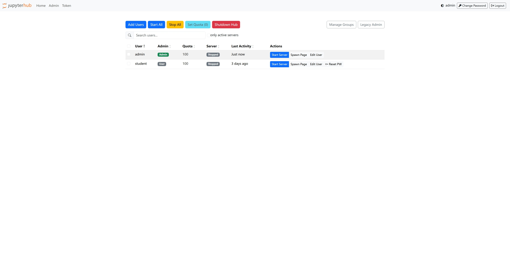
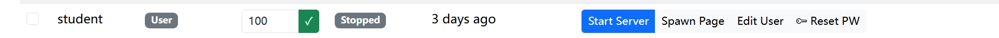
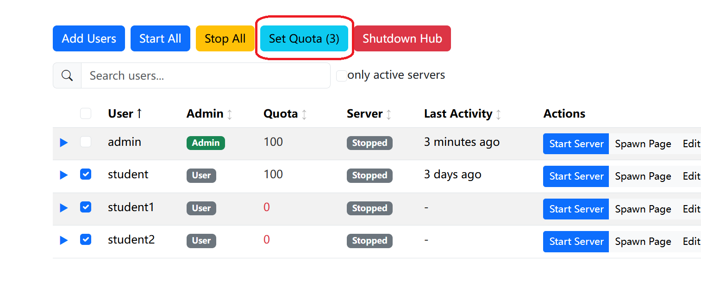
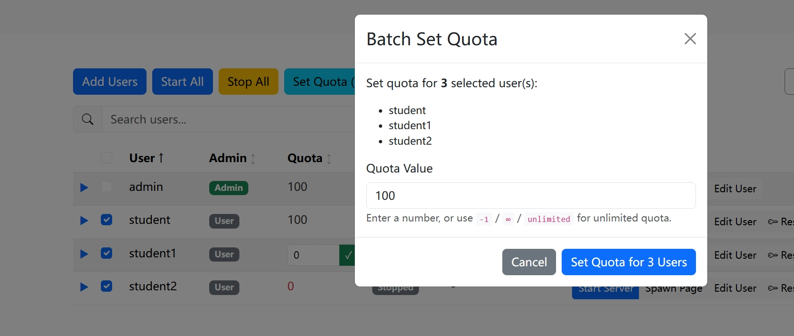

# User Quota System

The quota system manages and tracks resource usage for JupyterHub users. It enables administrators to allocate, monitor, and control how much compute time users can consume.

## Overview

### Key Concepts

- **Balance**: The amount of quota credits a user has available
- **Rate**: The cost per minute for different resource types (CPU, GPU, NPU)
- **Session**: A tracked period of container usage that consumes quota
- **Unlimited Quota**: Special status exempting users from quota deductions

### How It Works

1. User requests to start a container
2. System checks if user has sufficient quota for the estimated runtime
3. If sufficient, a usage session begins tracking time
4. When container stops, actual usage is calculated and quota is deducted
5. Formula: `quota_consumed = rate × duration_minutes`

## Configuration

Configure the quota system in your Helm values.yaml under `custom.quota`:

```yaml
custom:
  quota:
    enabled: null              # Enable/disable quota system (null = auto-detect based on authMode)
    cpuRate: 1                 # Cost per minute for CPU-only containers
    minimumToStart: 10         # Minimum quota required to start any container
    defaultQuota: 0            # Default quota granted to new users (0 = no initial allocation)
```

### New User Default Quota

The `defaultQuota` setting controls how much quota new users receive automatically:

- **Value `0` (default)**: New users start with zero quota and must be manually granted quota by an administrator
- **Value `> 0`**: New users are automatically granted this amount when they first attempt to use the system

**Example configuration:**
```yaml
custom:
  quota:
    defaultQuota: 100  # Automatically grant 100 quota units to new users
```

#### How It Works

This automatic allocation happens when a new user first tries to start a container. The system will:
1. Check if the user has a quota record in the database
2. If not found and `defaultQuota > 0`, create a record with the default amount
3. Record this as an "initial_grant" transaction in the audit log

### Unlimited Quota

Unlimited quota status is managed via the Admin UI. To grant unlimited quota to a user:
1. Go to the Admin Panel (`/hub/admin/users`)
2. Click on the user's quota value
3. Enter `-1`, `∞`, or `unlimited` in the input field
4. Click Save

### Quota Rates by Resource Type

Each accelerator type can have a different quota rate defined in `custom.accelerators`:

```yaml
custom:
  accelerators:
    phx:
      quotaRate: 2          # Phoenix iGPU: 2 quota/minute
    strix:
      quotaRate: 2          # Strix iGPU: 2 quota/minute
    strix-halo:
      quotaRate: 3          # Strix Halo iGPU: 3 quota/minute
    dgpu:
      quotaRate: 4          # Discrete GPU: 4 quota/minute
    strix-npu:
      quotaRate: 1          # NPU: 1 quota/minute
```

### Auto-Enable Behavior

The quota system is automatically enabled/disabled based on authentication mode:
- **Enabled**: `github`, `multi` authentication modes
- **Disabled**: `auto-login`, `dummy` modes (typically for development)

### Scheduled Quota Refresh (CronJob)

You can configure automatic quota refresh rules that run on a schedule. Each rule creates a Kubernetes CronJob.

#### Basic Setup

Add refresh rules to your `values.yaml`:

```yaml
custom:
  quota:
    refreshRules:
      daily-topup:
        enabled: true
        schedule: "0 0 * * *"       # Every day at midnight
        action: add                  # add or set
        amount: 100                  # Add 100 quota daily
        maxBalance: 500              # Cap balance at 500
        targets:
          includeUnlimited: false    # Skip unlimited users
```

#### Configuration Options

| Field | Type | Description |
|-------|------|-------------|
| `enabled` | bool | Enable/disable this rule |
| `schedule` | string | Cron expression (e.g., `"0 0 * * *"` = daily at midnight) |
| `action` | string | `add` (default) or `set` |
| `amount` | int | Quota amount (positive to add, negative to deduct) |
| `maxBalance` | int | Maximum balance cap (for `add` action) |
| `minBalance` | int | Minimum balance floor (prevents going negative) |
| `targets` | object | Targeting rules (see below) |

#### Targeting Options

Filter which users are affected:

| Target | Type | Description |
|--------|------|-------------|
| `includeUnlimited` | bool | Include users with unlimited quota |
| `balanceBelow` | int | Only users with balance below this value |
| `balanceAbove` | int | Only users with balance above this value |
| `includeUsers` | list | Only these specific usernames |
| `excludeUsers` | list | Exclude these usernames |
| `usernamePattern` | string | Regex pattern (e.g., `"^student_.*"`) |

#### Example Rules

```yaml
custom:
  quota:
    refreshRules:
      # Daily top-up: Add 100 to users below 400
      daily-topup:
        enabled: true
        schedule: "0 0 * * *"
        action: add
        amount: 100
        maxBalance: 500
        targets:
          includeUnlimited: false
          balanceBelow: 400

      # Monthly reset: Set everyone to 500
      monthly-reset:
        enabled: true
        schedule: "0 0 1 * *"        # 1st of each month
        action: set
        amount: 500
        targets:
          includeUnlimited: false

      # Weekly decay: Deduct 50 from users above 100
      weekly-decay:
        enabled: false
        schedule: "0 0 * * 0"        # Every Sunday
        amount: -50
        minBalance: 0
        targets:
          balanceAbove: 100
```

#### Cron Schedule Syntax

```
┌───────────── minute (0-59)
│ ┌───────────── hour (0-23)
│ │ ┌───────────── day of month (1-31)
│ │ │ ┌───────────── month (1-12)
│ │ │ │ ┌───────────── day of week (0-6, Sun=0)
│ │ │ │ │
* * * * *
```

Common examples:
- `"0 0 * * *"` - Daily at midnight
- `"0 8 * * 1-5"` - Weekdays at 8:00 AM
- `"0 0 1 * *"` - 1st of each month at midnight
- `"0 0 * * 0"` - Every Sunday at midnight
- `"*/30 * * * *"` - Every 30 minutes

#### Verify CronJobs

After `helm upgrade`, check if CronJobs are created:

```bash
# List quota refresh CronJobs
kubectl -n jupyterhub get cronjobs -l app.kubernetes.io/component=quota-refresh

# Check recent job runs
kubectl -n jupyterhub get jobs -l app.kubernetes.io/component=quota-refresh

# View logs from last run
kubectl -n jupyterhub logs -l app.kubernetes.io/component=quota-refresh --tail=50
```

## Admin Operations

### Web Interface (Admin Panel)

The Admin Panel provides a graphical interface for quota management. Access it at `/hub/admin/users`.



#### Quota Column

When the quota system is enabled, the Users page displays a **Quota** column showing each user's balance.

#### Inline Editing

Click directly on a user's quota value to edit:
- Enter a new number and press **Enter** to save
- Press **Escape** to cancel
- Enter `-1`, `∞`, or `unlimited` to grant unlimited status



#### Batch Operations

1. Select multiple users using checkboxes
2. Click "Set Quota" button (appears when users are selected)



3. Enter the quota value:
   - A number (e.g., `500`) to set exact balance
   - `-1`, `∞`, or `unlimited` to grant unlimited status
4. Click "Apply" to update all selected users



### REST API Endpoints

All admin endpoints require authentication. Admin-specific operations require admin privileges.

#### List All User Quotas

```
GET /admin/api/quota/
```

**Response:**
```json
{
  "users": [
    {"username": "user1", "balance": 500, "unlimited": false, "updated_at": "2026-01-15T10:00:00"},
    {"username": "user2", "balance": 1000, "unlimited": true, "updated_at": "2026-01-15T09:30:00"}
  ]
}
```

#### Get Single User Quota

```
GET /admin/api/quota/<username>
```

**Response:**
```json
{
  "username": "user1",
  "balance": 500,
  "unlimited": false,
  "recent_transactions": [
    {
      "id": 123,
      "username": "user1",
      "amount": -10,
      "transaction_type": "usage",
      "resource_type": "cpu",
      "description": "Session 456: 10 minutes",
      "balance_before": 510,
      "balance_after": 500,
      "created_at": "2026-01-15T10:00:00",
      "created_by": null
    }
  ]
}
```

#### Modify User Quota

```
POST /admin/api/quota/<username>
Content-Type: application/json
```

```json
{
  "action": "set",
  "amount": 100,
  "unlimited": true,
  "description": "Monthly allocation"
}
```

- `action`: `"set"`, `"add"`, `"deduct"`, or `"set_unlimited"`
- `amount`: Required for set/add/deduct
- `unlimited`: Required for set_unlimited

**Actions:**
- `set`: Set balance to exact amount
- `add`: Add amount to current balance
- `deduct`: Subtract amount from balance
- `set_unlimited`: Mark/unmark user as having unlimited quota

**Response:**
```json
{
  "username": "user1",
  "balance": 100,
  "action": "set",
  "amount": 100
}
```

#### Batch Set Quota

```
POST /admin/api/quota/batch
Content-Type: application/json
```

```json
{
  "users": [
    {"username": "user1", "amount": 100},
    {"username": "user2", "amount": 200}
  ]
}
```

**Response:**
```json
{
  "success": 2,
  "failed": 0,
  "details": [
    {"username": "user1", "status": "success", "balance": 100},
    {"username": "user2", "status": "success", "balance": 200}
  ]
}
```

#### Batch Refresh Quota

Flexible batch operation with targeting rules:

```
POST /admin/api/quota/refresh
Content-Type: application/json
```

```json
{
  "rule_name": "weekly_reset",
  "action": "add",
  "amount": 100,
  "max_balance": 1000,
  "min_balance": 0,
  "targets": {
    "includeUnlimited": false,
    "balanceBelow": 500,
    "balanceAbove": 0,
    "includeUsers": ["user1"],
    "excludeUsers": ["admin"],
    "usernamePattern": "^student_.*"
  }
}
```

Request fields:
- `action`: `"add"` or `"set"`
- `max_balance`: Optional cap for balance
- `min_balance`: Optional floor for balance

**Targeting Rules (AND logic):**
- `includeUnlimited`: Whether to include users marked as unlimited
- `balanceBelow`: Only affect users with balance below this value
- `balanceAbove`: Only affect users with balance above this value
- `includeUsers`: Whitelist of specific usernames
- `excludeUsers`: Blacklist of usernames to skip
- `usernamePattern`: Regex pattern to match usernames

**Response:**
```json
{
  "users_updated": 25,
  "total_change": 2500,
  "skipped": 5,
  "action": "add",
  "rule_name": "weekly_reset"
}
```

### CLI Commands (manage_users.py)

The `manage_users.py` script provides command-line quota management via kubectl.

#### Set Quota

Set quota to a specific amount:

```bash
# Set quota for specific users
python scripts/manage_users.py set-quota user1 user2 --amount 1000

# Set quota from file (requires username column, optional quota column)
python scripts/manage_users.py set-quota -f users.csv --amount 500

# File with per-user amounts
python scripts/manage_users.py set-quota -f users_with_quota.csv
```

**File format (users_with_quota.csv):**
```csv
username,quota
student01,500
student02,1000
teacher01,2000
```

#### Add Quota

Add quota to existing balance:

```bash
# Add to specific users
python scripts/manage_users.py add-quota user1 user2 --amount 100

# Add to users from file
python scripts/manage_users.py add-quota -f users.csv --amount 50
```

#### List Quota Balances

Display all user quota balances:

```bash
python scripts/manage_users.py list-quota
```

**Output:**
```
📋 Quota Balances (25 users):

Username                  Balance         Last Updated
-----------------------------------------------------------------
student01                 450             2026-01-15 10:30:00
student02                 800             2026-01-15 09:15:00
teacher01                 1500            2026-01-14 16:45:00
```

## User Experience

### Viewing Personal Quota

Users can check their quota via the API:

```
GET /api/quota/me
```

**Response:**
```json
{
  "username": "student01",
  "balance": 450,
  "unlimited": false,
  "rates": {"cpu": 1, "phx": 2, "strix": 2},
  "enabled": true
}
```

To get accelerator options, use the separate `/api/accelerators` endpoint.

### Quota Rates API

Get quota rates and configuration (available to all authenticated users):

```
GET /api/quota/rates
```

**Response:**
```json
{
  "enabled": true,
  "rates": {"cpu": 1, "phx": 2, "strix": 2},
  "minimum_to_start": 10
}
```

- `enabled`: Whether the quota system is active
- `rates`: Quota consumption rate per minute for each resource type
- `minimum_to_start`: Minimum quota required to start any container

### Accelerators API

Get available accelerator options (always available, independent of quota system):

```
GET /api/accelerators
```

**Response:**
```json
{
  "accelerators": {
    "phx": {
      "displayName": "AMD Radeon™ 780M (Phoenix Point iGPU)",
      "description": "RDNA 3.0 (gfx1103) | Compute Units 12 | 4GB LPDDR5X",
      "nodeSelector": {"accelerator": "phx"},
      "quotaRate": 2
    }
  }
}
```

- `accelerators`: Available accelerator options with display name, description, node selector, and quota rate

### Insufficient Quota

When a user attempts to start a container without sufficient quota:

1. System calculates estimated cost: `rate × requested_runtime`
2. Compares with current balance and minimum requirement
3. If insufficient, returns HTTP 403 error with message:

```
Cannot start container: Insufficient quota. Current balance: 5,
estimated cost: 120 (2 quota/min × 60 min).
Please contact administrator to add quota.
```

### Quota Deduction

Quota is deducted when a container stops:

1. System records actual duration (minimum 1 minute)
2. Calculates actual cost: `rate × actual_duration_minutes`
3. Deducts from user balance
4. Records transaction in audit log

## Technical Details

### Stale Session Cleanup

Sessions stuck for more than 8 hours are automatically cleaned up on hub startup:

- Marks session as `cleaned_up`
- Records duration but does NOT deduct quota (avoids charging for crashed sessions)
- Logs cleanup for auditing

### Unlimited Quota Logic

A user has unlimited quota if marked `unlimited: true` in the database.

## Troubleshooting

### User Cannot Start Container

**Symptom:** "Insufficient quota" error

**Solutions:**
1. Check user's current balance:
   ```bash
   python scripts/manage_users.py list-quota | grep username
   ```

2. Add quota to user:
   ```bash
   python scripts/manage_users.py add-quota username --amount 500
   ```

3. Or grant unlimited quota via Admin UI (click quota value and enter `∞`)

### Quota Not Being Deducted

**Symptom:** User's balance doesn't decrease after container use

**Possible causes:**
1. User has unlimited quota (set via Admin UI)
2. Quota system is disabled (`custom.quota.enabled: false`)
3. Session ended abnormally (cleaned up as stale)

**Check:**
```bash
# View user's transaction history
curl "$JUPYTERHUB_URL/admin/api/quota/username" \
  -H "Authorization: token $JUPYTERHUB_TOKEN"
```

### Session Stuck as Active

**Symptom:** Old sessions show as active even though containers stopped

**Solution:** Sessions are automatically cleaned on hub restart, or manually:
```bash
# Restart hub to trigger cleanup
kubectl -n jupyterhub rollout restart deployment/hub
```

### Database Issues

**Location:** `/srv/jupyterhub/quota.sqlite` (inside hub pod)

**Access for debugging:**
```bash
kubectl -n jupyterhub exec deployment/hub -- sqlite3 /srv/jupyterhub/quota.sqlite \
  "SELECT * FROM user_quota LIMIT 10;"
```

## See Also

- [User Management Guide](./user-management.md) - Batch user operations
- [Authentication Guide](./authentication-guide.md) - User authentication setup
