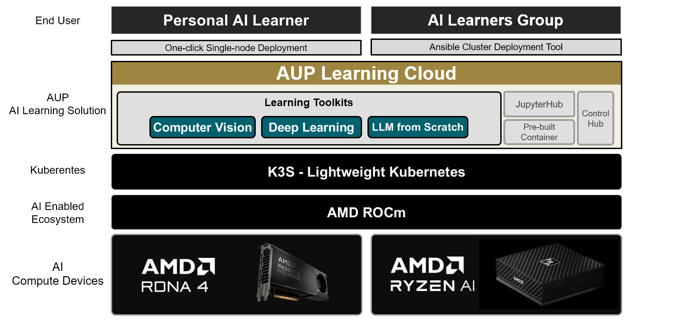

.. AUP Learning Cloud documentation master file

Welcome to AUP Learning Cloud Documentation
===========================================

AUP Learning Cloud is a tailored JupyterHub deployment designed to provide an intuitive and hands-on AI learning experience. It features a comprehensive suite of AI toolkits running on AMD hardware acceleration, enabling users to learn and experiment with ease.

.. toctree::
   :maxdepth: 2
   :caption: Getting Started

   getting-started/index
   getting-started/quick-start
   getting-started/installation

.. toctree::
   :maxdepth: 2
   :caption: User Guide

   user-guide/index

.. toctree::
   :maxdepth: 2
   :caption: JupyterHub Configuration

   jupyterhub/index

.. toctree::
   :maxdepth: 1
   :caption: Contributing

   contributing/contributing

Indices and tables
==================

* :ref:`genindex`
* :ref:`search`
